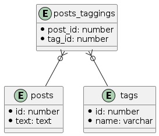

# 1

```
TABLE Post {
id: varchar
text: varchar
tags: varchar   -- ("tagA,tagB,tagC"といった値が入る)
}
```

この作りだとどのような問題があるか？

- タグ自体の管理が大変
  - タグのCreate, Update, Destroyを行う場合、各Postを見にいかなければいけない
- タグに関するクエリが遅くなる
  - タグからPostを検索、人気のタグを検索など、大体LIKEを使わなければいけなくなる

# 2

tagsテーブルを用意し、postとtagの関係を中間テーブルで表現するように修正する

修正後のUMLは以下
```
@startuml
entity "posts" {
  *id: number
  *text: text
}

entity "posts_taggings" {
  *post_id: number
  *tag_id: number
}

entity "tags" {
  *id: number
  *name: varchar
}

posts_taggings }o-- posts
posts_taggings }o-- tags
@enduml
```



