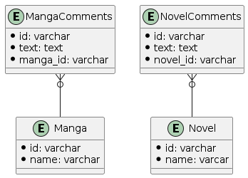

# 1 

ポリモーフィック関連の問題点

- 参照整合性がなくなる
  - DBレベルで参照整合性が担保できないため、アプリケーション側で制御しなければならない
- コメントを個別にカスタマイズできない

# 2

抽象化せず、別々にコメントテーブルを設計しなおす

```
entity MangaComments {
  *id: varchar
  *text: text
  *manga_id: varchar
}

entity Novel {
  *id: varchar
  *name: varcar
}

entity NovelComments {
  *id: varchar
  *text: text
  *novel_id: varchar
}

MangaComments }o-- Manga
NovelComments }o-- Novel
@enduml
```


