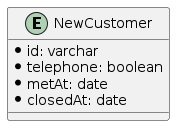

# 課題1

```
TABLE NewCustomer {

id: varchar

telephone: boolean -- 電話をかけたらTRUEになる

metOnce: boolean -- アポで面談したらTRUEになる

metAt: date -- 面談をした日付が入る

closed: boolean -- 成約した

closedAt: boolean -- 成約した日付が入る

}
```

属性が存在するかのフラグと属性自体を格納するカラムが存在しているが、前者は後者の値があるかどうかを確認すれば良いので必要のないカラムになっている

# 課題2

```
TABLE NewCustomer {

id: varchar

telephone: boolean -- 電話をかけたらTRUEになる

metAt: date -- 面談をした日付が入る。面談していない場合、dateの最大値を入れておく

closedAt: date -- 成約した日付が入る。成約していない場合、dateの最大値を入れておく

}
```


