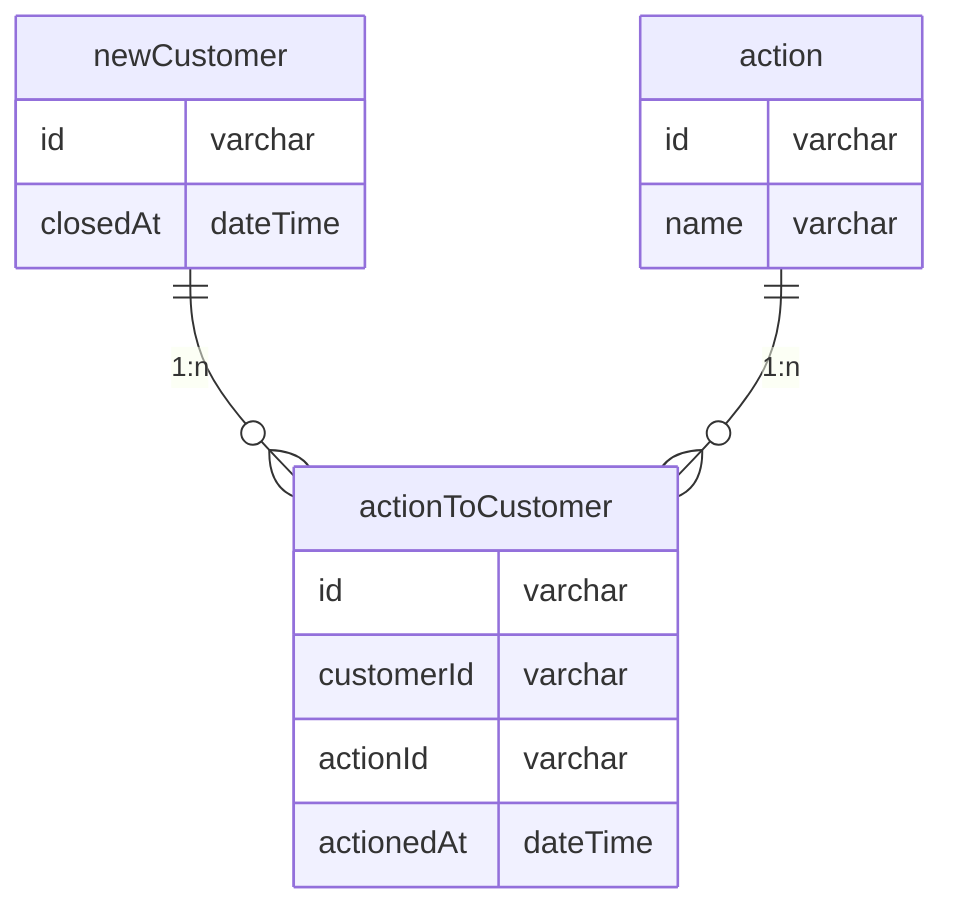

# 課題1

```
TABLE NewCustomer {

id: varchar

telephone: boolean -- 電話をかけたらTRUEになる

metOnce: boolean -- アポで面談したらTRUEになる

metAt: date -- 面談をした日付が入る

closed: boolean -- 成約した

closedAt: boolean -- 成約した日付が入る

}
```

- 属性が存在するかのフラグ属性自体を格納するカラムが存在しているが、前者は後者の値があるかどうかを確認すれば良いので必要のないカラムになっている
- 電話をかけた日時がわからない
- アポの方法を増やす場合、カラムを増やす必要がある

# 課題2


