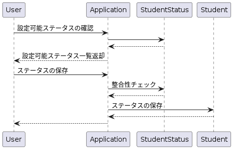

# 1

```
TABLE Student {

id: varchar

name: varchar

status: varchar CHECK(status IN ("studying", "graduated", "suspended"))

}
```

- 定義された値の取得が困難
  - フロントからstatusを設定する時、設定できるステータス一覧を表示できなければいけない。この時、DBから設定できるステータス一覧を返すのが大変
    - students一覧からdistinctを使ってステータス一覧を取得することができそうだが、未定義のステータスがあるとそこが抜ける
    - システムビューから定義可能ステータスを返せるが、あまりよろしくない
      - システムビューから取得したメタデータはただの文字列であるため、アプリケーション側で加工が必要

- 設定可能なステータスを変更するとき、マイグレーションが必要になる(alter tableで定義を変更する必要あり)

- 過去のデータを消すのが困難。deprecatedのフラグをつけるとしても、アプリケーション側か別のカラムが必要となり、二重管理になる

- データ移行が困難
  - RDBMS製品によってcheck制約の扱いが異なるため、同じ設定のまま移植するのは難しい

# 2

定義可能ステータス一覧テーブルを用意し、statusカラムにはそのidを格納するようにする

```

TAABLE StudentStatus {
  id: varchar
  value: varchar
  is_active: boolean
}

TABLE Student {

id: varchar

name: varchar

status_id: varchar

}
```

## UML



```
@startuml
participant User
participant Application
participant StudentStatus
participant Student

User -> Application: 設定可能ステータスの確認
Application -> StudentStatus
StudentStatus --> Application
Application --> User: 設定可能ステータス一覧返却

User -> Application: ステータスの保存
Application -> StudentStatus: 整合性チェック
StudentStatus --> Application
Application -> Student: ステータスの保存
Student --> Application
Application --> User
@enduml
```
