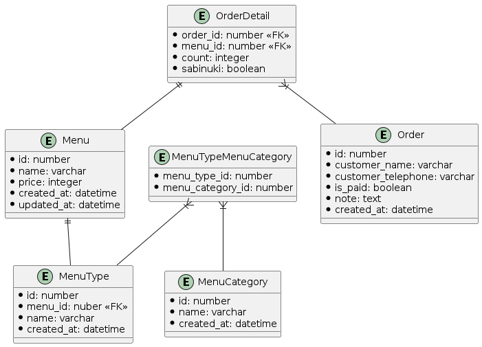

# 1

以下の注文表を実現するための論理設計を考える

https://github.com/praha-inc/praha-challenge-templates/blob/master/db/design/sushi.png

現段階でユーザー登録機能はまだなく、店舗に来てパネルで商品を選択するようなシステムを想定

## 論理モデルの設計

- Menus
  - id
  - name
  - price
  - created_at
  - updated_at

- MenuTypes（単品、セットなどの情報を記載）
  - id
  - menu_id
  - name
  - created_at
    
 - MenuCategories（握り、盛り込みなどの分類）
   - id
   - name
   - created_at

 - MenuTypeMenuCategories（MenuTypeとMenuCategoriesの中間テーブル）
   - menu_type_id
   - menu_category_id

- Orders
  - id
  - customer_name
  - customer_telephone
  - is_paid
  - note
  - created_at

- OrderDetails
  - order_id
  - menu_id
  - count
  - sabinuki

## UML

# 2

## オプションとしてシャリの大小も追加できるようにしたい。どうすれば良い？

メニューの共通オプションを格納するMenuOptionsテーブルを作成し、OrderDetailsテーブルに紐づけるための中間テーブルを作成する

これによりオプションの追加と、同じメニューを複数頼んだ時に一つ一つオプションを設定できる(例: さび抜きのエビ一つ、さび入りかつシャリ大のエビ二つ)

- Menus
  - id
  - name
  - price
  - created_at
  - updated_at

- MenuTypes（単品、セットなどの情報を記載）
  - id
  - menu_id
  - name
  - created_at
    
 - MenuCategories（握り、盛り込みなどの分類）
   - id
   - name
   - created_at

 - MenuTypeMenuCategories（MenuTypeとMenuCategoriesの中間テーブル）
   - menu_type_id
   - menu_category_id

- MenuOptions
  - id
  - name
  - created_at
  - updated_at

- Orders
  - id
  - customer_name
  - customer_telephone
  - is_paid
  - note
  - created_at

- OrderDetails
  - order_id
  - menu_id
  - count

- OrderDetailOptions
  - order_detail_id
  - menu_option_id

## 人気の寿司ネタを特定したい。単品が毎月いくつ売れているか集計したが、どうすれば良い？

いつ注文されたネタと、いつ注文されたかが特定できるようになっていれば良い
この要件は現状の設計で対応できる

# 3

## 今後追加されそうな要件を考える

「シャリ大」オプションに以下の要件を追加したい
- 有料化(プラス50円)
- ネタによってはシャリ大ができないようにしたい
