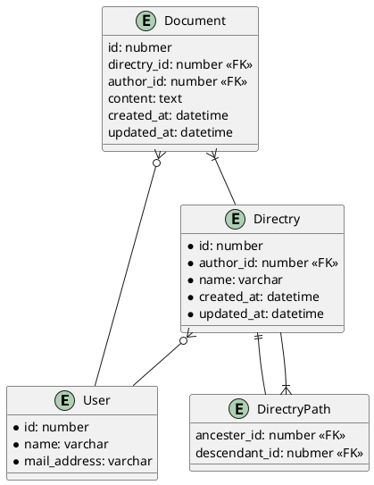
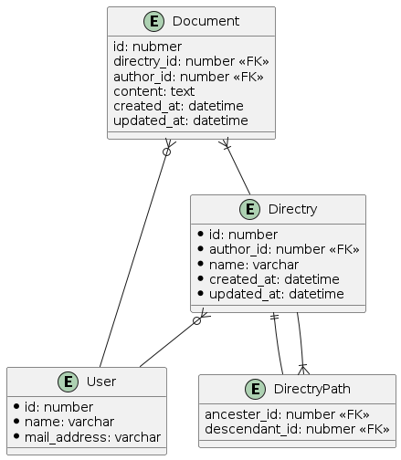

# 1

以下の機能を持つドキュメント管理システムのDB設計を考える

- ドキュメント
  - いつ、誰が、どんなテキスト情報を保存したのか管理する
  - ドキュメントは必ず何らかのディレクトリに属する
- ディレクトリ
  - 一つ以上のドキュメントを含む階層構造
  - ディレクトリは無制限にサブディレクトリを持つことができる
  - ディレクトリ構造は柔軟に変更可能。ディレクトリが移動してサブディレクトリになることもあり得る
- ユーザ
  - ドキュメントをCRUD（作成、参照、更新、削除）できる
  - ディレクトリをCRUDできる

## DB設計

- Users
  - id
  - name
  - mail_address

- Directries
  - id
  - author_id
  - name
  - created_at
  - updated_at

- DirectryPath（ディレクトリの閉包テーブル）
  - ancester_id
  - descendant_id

- Documents
  - id
  - directory_id
  - content
  - author_id
  - created_at
  - updated_at

## ER図

