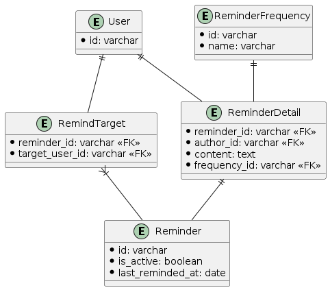

# リマインダーアプリのDB設計

## 仕様

- ユーザ
  - 他のユーザ（複数可）宛にリマインダーを設定できる
- リマインダー
  - 送信相手、文面、頻度を指定可能
  - 1時間ごとにバッチが動き、配信が必要なリマインダーを指定されたユーザに配信する
- リマインダーの周期
  - 設定可能な周期は、現時点では以下の4種類
    - 毎日
    - X日おき
    - 毎週X曜日
    - 毎月X日

## DB設計

```plantuml
entity User {
  *id: varchar
}  

entity Reminder {
  *id: varchar
  *is_active: boolean
  *last_reminded_at: date
}

entity RemindTarget {
  *reminder_id: varchar <<FK>>
  *target_user_id: varchar <<FK>>
}

entity ReminderDetail {
  *reminder_id: varchar <<FK>>
  *author_id: varchar <<FK>>
  *content: text
  *frequency_id: varchar <<FK>>
}

entity ReminderFrequency {
  *id: varchar
  *name: varchar
}
```



## メモ

リマインドすべきリマインダーを取得

```SQL
-- 未完了のリマインダー情報を取得
select *
from reminders r
  join
    reminder_details d
      on r.is_active = true
        and r.id = d.reminder_id
      join reminder_frequencies f on d.frequency_id = f.id
  join remind_targets t on r.id = t.id
    join users u on t.id = u.id

-- join多すぎるので、リマインドすべきリマインダー取得→それに対して詳細取得と分けても良いかも
-- その場合、freqencyはremindersテーブルに持たせた方がいいかも
```
