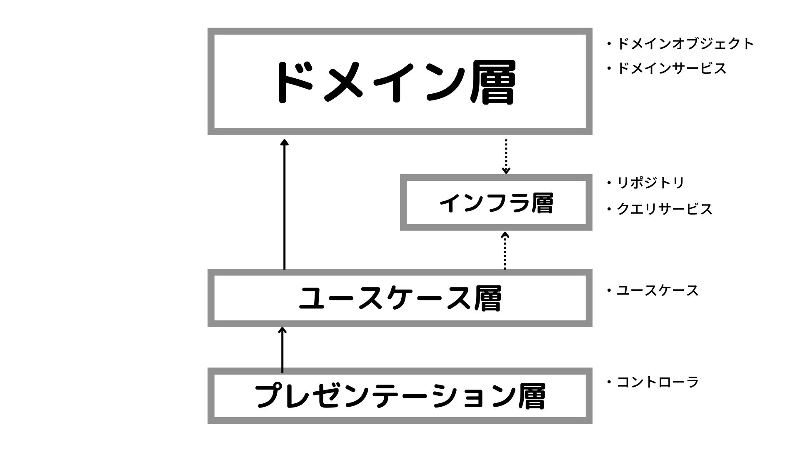

# オニオンアーキテクチャの図解

# ドメイン層

ドメイン層が他の層に依存しないことによって、どのようなメリットがあるか？
- ビジネスロジックが表示の条件やRDBMS特有の事情などの影響を受けにくくなり、保守性が高まる
- ビジネスロジックが他のレイヤに散らばった場合と比べて認知負荷が低くなる

# 層を跨ぐ時にインターフェースのみに依存することによって、何が嬉しいか？

- 実装の詳細のみに変更があったとき、使う側はその影響を受けなくなる

# オニオンアーキテクチャにおけるDIP

以下のインフラ層に対してDIPが適用され、インフラ層のインターフェースに対してドメイン層、ユースケース層が依存するようになっている
- ドメイン層→インフラ層←ユースケース層

# 特定のユーザにしかリソースの追加や更新を許さないようなアクセス制限機能を実装する時、どこにどのように実装すべきか

一つのレイヤーで行わず、各レイヤーでそれぞれ必要と思われる処理を実装する

例: タスク管理のSaaSで、タスクの削除は管理者でないと行うことができないとする
以下のようなエンドポイントで削除を行う

- DELETE /tasks/{taskId}

実装
- プレゼンテーション層
  - アクセスしてきたユーザーが管理者でなければ401ステータスコード(Unauthorized)を返す
- ドメイン層
  - 削除のドメインサービスでユーザーが管理者でなければ例外を発生させる
- インフラ層
  - RawLevelSecurityやトリガーなど、インフラ層で行える制限を行う（ここはよっぽど重要でなければいらない）

# データベースをMySQLからPostgreSQLに変更する時、どの層を変更するか

- インフラ層

# クイズ

- レイヤードアーキテクチャとオニオンアーキテクチャの違いを教えてください
- 外部のAPIと連携する処理が必要になり、そのAPIクライアントのようなモジュールを作ることになりました。これはどのレイヤに実装すべきでしょうか？
- ドメインサービスは積極的に使うべきではないとされています。それはなぜでしょうか？
